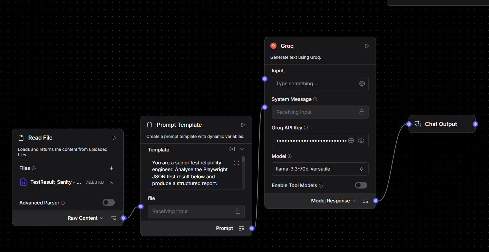
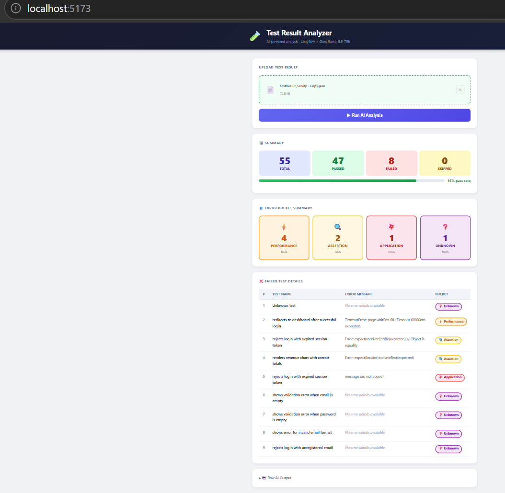

# AI Test Result Analyzer

## Overview

This folder contains the AI Test Result Analyzer application, a complete solution for uploading Playwright JSON test results, analyzing failures with AI, and presenting the findings in a structured report.

The application includes:
- React + Vite frontend UI for file upload and result visualization
- Backend upload and analysis endpoint
- AI prompt definition for test result classification
- Sample JSON input for validation
- Vercel deployment configuration

## Project structure

- `api/` — serverless API route for `/api/analyze`
- `src/` — frontend React application
- `server.js` — local Express server for development and static serving
- `index.html` — Vite app entry HTML
- `vite.config.js` — Vite configuration
- `vercel.json` — Vercel deployment settings
- `AI_TestResult-Analysis_Prompt.md` — analysis prompt instructions
- `Langflow_Postman_Collection_v2.json` — sample API collection
- `TestResult_Sanity.json` — sample test result file
- `screenshots/` — local screenshot files for README and documentation
- `.gitignore` — git ignore rules for this folder

## Folder structure

This project contains the following folders and files:

- `api/` — backend route(s) for test result analysis
- `src/` — React app source files
- `screenshots/` — example screenshots included in documentation
- `temp/` — temporary upload folder (ignored in Git)

## Output behavior

When the user uploads a JSON test result file, the UI displays:
- Summary cards: total tests, passed, failed, skipped, and pass rate
- Error bucket summary: counts for Performance, Assertion, Application, Unknown, etc.
- Failed test details: test name, error message, and bucket classification

### UI flow and expected output

The attached screenshot shows the expected analyzer output flow:
1. Upload a JSON file in the `Upload Test Result` panel.
2. Click `Run AI Analysis`.
3. The `Summary` section displays overall totals and pass rate.
4. The `Error Bucket Summary` section shows classification counts.
5. The `Failed Test Details` table lists each failed test, error message, and bucket.

### Required input format

The analyzer expects a Playwright-style test result JSON file with the following characteristics:
- Top-level `stats` object containing `expected`, `unexpected`, `flaky`, `skipped`, and `duration`
- Nested suites and specs containing test names and results
- Error messages under `spec.tests[].results[].errors[]`
- Retry counts under `spec.tests[].results[].retry`

Example file:

```json
{
  "stats": {
    "expected": 47,
    "unexpected": 8,
    "flaky": 0,
    "skipped": 0,
    "duration": 12345
  },
  "root": {
    "suites": [
      {
        "specs": [
          {
            "title": "redirects to dashboard after successful login",
            "ok": false,
            "tests": [
              {
                "results": [
                  {
                    "status": "failed",
                    "retry": 0,
                    "errors": [
                      { "message": "TimeoutError: page.waitForURL: Timeout 60000ms exceeded." }
                    ]
                  }
                ]
              }
            ]
          }
        ]
      }
    ]
  }
}
```

This README documents the expected output layout and how to run the app to reproduce the results shown in the attached screenshot.

## Screenshots

The project includes local documentation screenshots in `screenshots/`.





## Git check-in guidance

### Files to commit
- `package.json`
- `package-lock.json`
- `server.js`
- `index.html`
- `vite.config.js`
- `vercel.json`
- `src/`
- `api/`
- `AI_TestResult-Analysis_Prompt.md`
- `Langflow_Postman_Collection_v2.json`
- `TestResult_Sanity.json`
- `README.md`

### Files to ignore
- `node_modules/`
- `dist/`
- `temp/`
- `.vercel/`
- `.env`
- editor and OS files like `.vscode/`, `.idea/`, `.DS_Store`, `Thumbs.db`

## Local development

To run locally:

```bash
cd TestResult_Analyzer/TestResult_Analysis_AI_Agent
npm install
npm run dev
```

This starts:
- Express API server on `http://localhost:3002`
- Vite frontend on `http://localhost:5171`

Open the URL shown in the terminal to upload a JSON file and run AI analysis.

## Vercel deployment

This folder can be deployed to Vercel as a static frontend with a serverless function.

### 1. Prepare the project

Ensure `api/analyze.js` is present and working. This file becomes the Vercel serverless API route.

### 2. Add environment variables

In Vercel dashboard, add:
- `LANGFLOW_URL` — the Langflow API endpoint
- `LANGFLOW_API_KEY` — the secret API key

If you keep local credentials, do not commit them.

### 3. Deploy to Vercel

From the project root or via Vercel CLI:

```bash
cd TestResult_Analyzer/TestResult_Analysis_AI_Agent
vercel --prod
```

If using the Vercel dashboard, connect the repository and set the root directory to `TestResult_Analyzer/TestResult_Analysis_AI_Agent`.

### 4. Verify deployment

After deployment:
- confirm the frontend loads
- confirm `/api/analyze` returns JSON
- upload `TestResult_Sanity.json` to verify output

## Langflow integration

The app is designed to send uploaded JSON to a Langflow analysis endpoint.

- `server.js` calls a local Langflow URL at `http://localhost:7860/api/v1/run/...`
- `api/analyze.js` can be used on Vercel with `LANGFLOW_URL`
- `AI_TestResult-Analysis_Prompt.md` defines the prompt used to classify test failures.

## Notes for Git readiness

- Keep this folder isolated for Git check-in
- Commit source files, configs, prompts, and sample test data
- Do not commit runtime/build artifacts or local secrets
- Use `.gitignore` to keep `node_modules/`, `dist/`, `temp/`, and `.vercel/` out of source control
